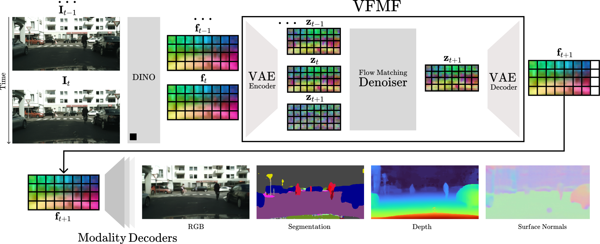

# VFMF: World Modeling by Forecasting Vision Foundation Model Features

  <a href="https://gabrijel-boduljak.com/" target="_blank" rel="noopener noreferrer">Gabrijel Boduljak</a> | 
  <a href="https://nirvanalan.github.io/" target="_blank" rel="noopener noreferrer">Yushi Lan</a> | 
  <a href="https://chrirupp.github.io/" target="_blank" rel="noopener noreferrer">Christian Rupprecht</a> | 
  <a href="https://www.robots.ox.ac.uk/~vedaldi/" target="_blank" rel="noopener noreferrer">Andrea Vedaldi</a>

  <a href="https://www.robots.ox.ac.uk/~vgg/">VGG, University of Oxford</a>

  <strong>Abstract</strong>
  

    Many recent methods forecast the world by generating stochastic
    videos. While these excel at visual realism, pixel prediction is
    computationally expensive and requires translating RGB into
    actionable signals for decision-making. An alternative uses vision
    foundation model (VFM) features as world representations,
    performing deterministic regression to predict future states.
    These features directly translate into useful signals like
    semantic segmentation and depth while remaining efficient.
    However, deterministic regression averages over multiple plausible
    futures, failing to capture uncertainty and reducing accuracy. To
    address this limitation, we introduce a generative forecaster
    using autoregressive flow matching in VFM feature space. Our key
    insight is that generative modeling in this space requires
    encoding VFM features into a compact latent space suitable for
    diffusion. This latent space preserves information more
    effectively than PCA-based alternatives for both forecasting and
    other applications like image generation. Our latent predictions
    decode easily into multiple interpretable modalities: semantic
    segmentation, depth, surface normals, and RGB. With matched
    architecture and compute, our method produces sharper, more
    accurate predictions than regression across all modalities and
    improves appearance prediction. Our results suggest that
    stochastic conditional generation of VFM features offers a
    promising, scalable foundation for future world models.
  

## Method

  

**An overview of our method VFMF.** Given RGB context frames $`\mathbf{I}_1,\dots,\mathbf{I}_t`$, we extract DINO features $`\mathbf{f}_1,\dots,\mathbf{f}_t`$ and predict the next state feature $`\mathbf{f}_{t+1}`$. Context features are compressed with a VAE along the channel dimension to produce context latents $`\mathbf{z}_1,\dots,\mathbf{z}_t`$. Those context latents are concatenated with noisy future latents $`\mathbf{z}_{t+1}`$ and passed to a conditional denoiser that denoises only the future latents $`\mathbf{z}_{t+1}`$ while leaving the context latents unchanged. This process repeats autoregressively, with a window of fixed length. Specifically, each time a new latent $`\mathbf{z}_{t+1}`$ is generated, it is appended to the context while the oldest context latent is popped. The denoised future latents are decoded back to DINO feature space by the VAE decoder. Finally, the reconstructed features can be routed to task-specific modality decoders for downstream tasks or interpretation.

## Instructions

**Code will be released soon.**
